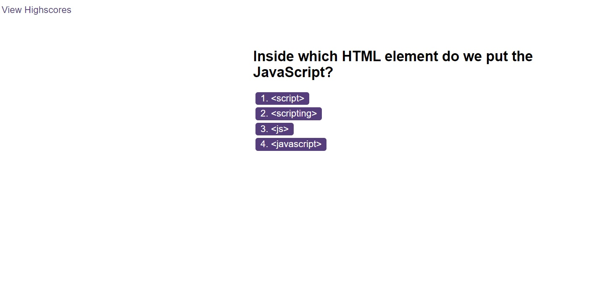

# Code-Quiz

## User Story

AS A coding boot camp student
I WANT to take a timed quiz on JavaScript fundamentals that stores high scores
SO THAT I can gauge my progress compared to my peers

## Description

A timed coding quiz with multiple-choice questions

## Acceptance Criteria

Create a code quiz that contains the following requirements:

- A start button that when clicked a timer starts and the first question appears.
 
  - Questions contain buttons for each answer.
  
  - When answer is clicked, the next question appears
   
  - If the answer clicked was incorrect then subtract time from the clock

- The quiz should end when all questions are answered or the timer reaches 0.

  - When the game ends, it should display their score and give the user the ability to save their initials and their score
  
   ## Usage
 
 Application screenshot: 
 
 
 When you enter a city the app will be like:
 
 
 Deployed application link:
 https://antonioalgaba.github.io/Code-Quiz/
 
 ## Technologies Used
HTML, CSS, JavaScript
